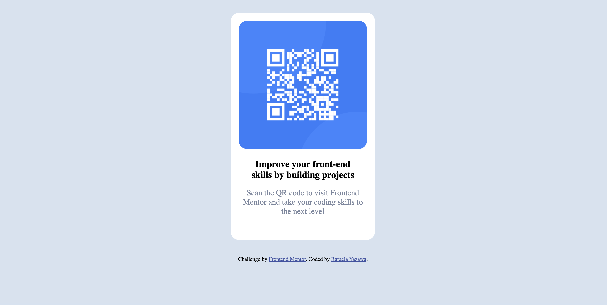
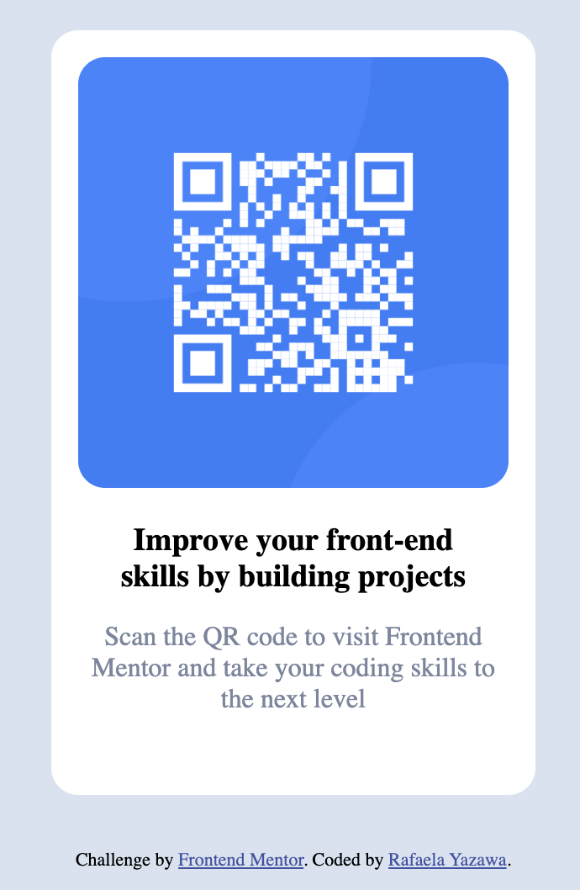

# Frontend Mentor - QR code component

This challenge consists of building a responsive [QR code component from Frontend Mentor](https://www.frontendmentor.io/challenges/qr-code-component-iux_sIO_H) using HTML and CSS.
 
This project helps improve coding skills by building realistic problems.

## Table of contents

- [Overview](#overview)
  - [Screenshot](#screenshot)
  - [Links](#links)
- [My process](#my-process)
  - [Built with](#built-with)
  - [What I learned](#what-i-learned)
  - [AI Collaboration](#ai-collaboration)
- [Author](#author)

## Overview

### Screenshot

My desktop solution

My mobile solution

### Links

- Solution URL: [Solution URL](https://www.frontendmentor.io/solutions/responsive-qr-code-component-with-flexbox-a_c9nVJxJ9)
- Live Site URL: [Live Site](https://rafaelayazawa.github.io/qr-code-component-challenge/)

## My process

### Built with

- HTML
- CSS
- Flexbox

### What I learned

- The difference between `max-width` and `width`, and how `max-width` helps to create responsive layouts
- How to use Flexbox on the parent element to control the layout and center content both vertically and horizontally
- The difference between content-based height and viewport height (`vh`)
- Why removing fixed heights can make layouts more flexible

### AI Collaboration

I used ChatGPT to clarify concepts related to responsive design, and spacing. It helped me better understand the difference between `width` and `max-width` works, as well as why and how to use Flexbox to control layout more intentionally.

I also asked for explanations, which helped me identify and correct misunderstandings. In particular, it clarified how height is determined (content vs viewport height) and how vertical centering works.

## Author

- Portfolio - [Rafaela Yazawa](https://rafaelayazawa.netlify.app/)
- Frontend Mentor - [@RafaelaYazawa](https://www.frontendmentor.io/profile/RafaelaYazawa)
